# 3 - AspectJ: syntax basics 1

## Pointcuts

In AspectJ, pointcuts can be either anonymous or named. Anonymous pointcuts, like anonymous classes, are defined at the place of their usage, such as a part of advice, or at the time of the definition of another pointcut. Named pointcuts are elements that can be referenced from multiple places, making them reusable.

Named pointcuts use the following syntax: `[access specifier] pointcut pointcut-name([args]) : pointcut-definition`

Example:

```aspectj
public pointcut accountOperations() : call(* Account.*(..))
```

### Wildcards and pointcut operators

Three wildcard notations are available in AspectJ:

-   `*` denotes any number of characters except the period
-   `..` denotes any number of characters including any number of periods
-   `+` denotes any subclass or subinterface of a given type

AspectJ provides a unary negation operator (!) and two binary operators (|| and &&).

### Signature syntax

In Java, the classes, interfaces, methods, and fields all have signatures. You use these signatures in pointcuts to specify the places where you want to capture join points.

When we specify patterns that will match these signatures in pointcuts, we refer to them as _signature patterns_.

There are 3 type of signatures patterns:

-   Type signature patterns
-   Method signature patterns
-   Method constructor signature patterns
-   Field signature patterns

#### Type signature patterns

The term type refers to classes, interfaces, primitive types and aspects. A type signature pattern in a pointcut specifies the join points in a type at which you want to perform some crosscutting action.

Wildcards:

-   `*` is used to specify a part of the class, interface or package name
-   `..` is used to denote all direct and indirect subpackages
-   `+` is used to denote a subclass or subinterface

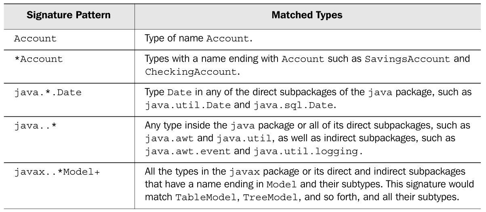

#### Method signature patterns

Method signature patterns allow the pointcuts to identify call and execution join points in methods that match the signature patterns.

In method signatures the wildcard `..` is used to denote any type and number of arguments taken by a method.

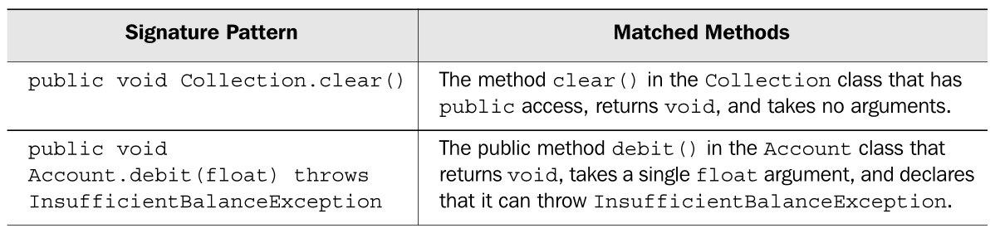
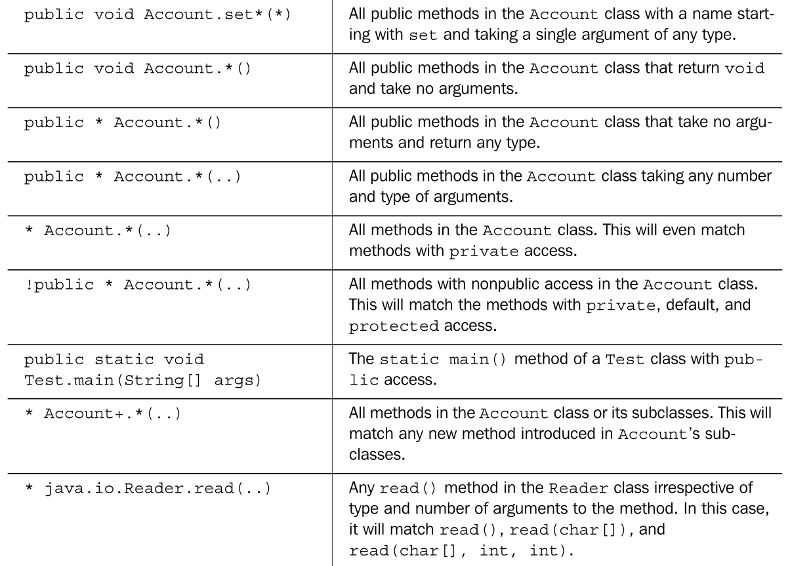
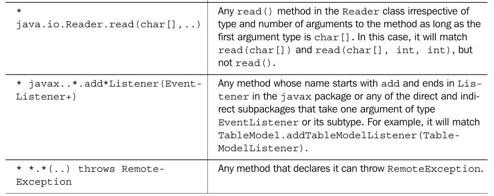

#### Constructor signature patterns

Constructor signature patterns allow the pointcuts to identify call and execution join points in constructors that match the signature patterns.

In constructor signatures the wildcard `..` is used to denote any type and number of arguments taken by a constructor.

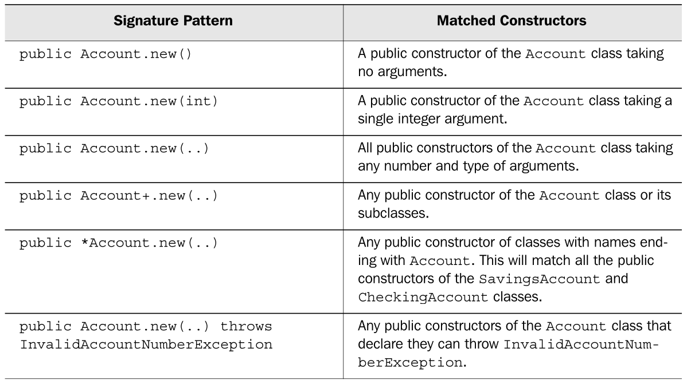

#### Field signature patterns

Much like the method signature, the field signature allows you to designate a member field. You can then use the field signatures to capture join points corresponding to read or write access to the specified fields.

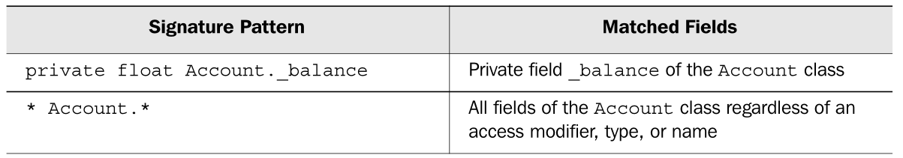
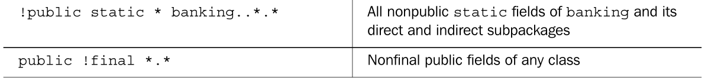

### Implementing pointcuts

There are two ways that pointcut designators match join points in AspectJ.

The first way captures join points based on the category to which they belong. Join points can be grouped into categories that represent the kind of join points they are, such as method call join points, method execution join points, field get join points, exception handler join points, and so forth.

The pointcuts that map directly to these categories or _kinds_ of exposed join points are referred as **kinded** pointcuts.

The second way that pointcut designators match join points is when they are used to capture join points based on matching the circumstances under which they occur, such as **control flow**, **lexical scope**, and **conditional checks**.

These pointcuts capture join points in any category as long as they match the prescribed condition. Some of the pointcuts of this type also allow the collection of context at the captured join points.

#### Kinded pointcuts

Kinded pointcuts follow a specific syntax to capture each kind of exposed join point in AspectJ.

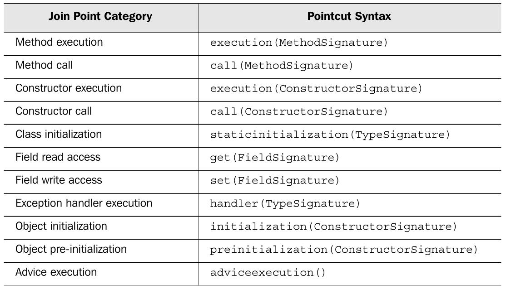

#### Control-flow based pointcuts

These pointcuts capture join points based on the control flow of join points captured by another pointcut. The control flow of a join point defines the flow of the program instructions that occur as a result of the invocation of the join point.

Think of control flow as similar to a call stack. For example, the `Account.debit()` method calls `Account.getBalance()` as a part of its execution; the call and the execution of `Account.getBalance()` is said to have occurred in the `Account.debit()` method's control flow, and therefore it has occurred in the control flow of the join point for the method.

In a similar manner, it captures other methods, field access, and exception handler join points within the control flow of the method's join point.

A control-flow pointcut always specifies another pointcut as its argument. There are two control-flow pointcuts.

The first pointcut is expressed as `cflow(Pointcut)`, and it captures all the join points in the control flow of the specified pointcut, including the join points matching the pointcut itself.

The second pointcut is expressed as `cflowbelow(Pointcut)`, and it excludes the join points in the specified pointcut.

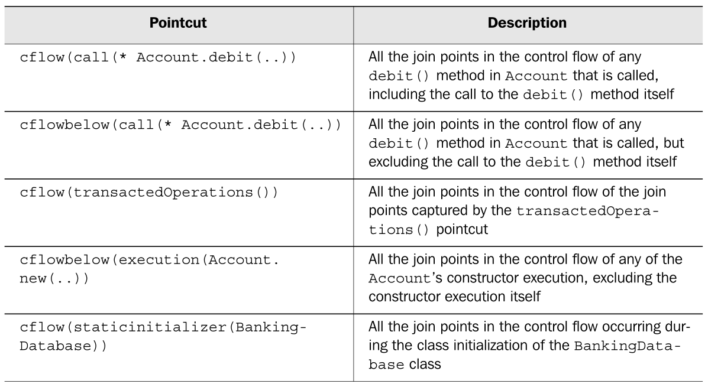

#### Lexical-structure based pointcuts

A lexical scope is a segment of source code. It refers to the scope of the code as it was written, as opposed to the scope of the code when it is being executed, which is the dynamic scope.

Lexical-structure based pointcuts capture join points occurring inside a lexical scope of specified classes, aspects, and methods.

There are two pointcuts in this category: `within()` and `withincode()`.

The `within()` pointcuts take the form of `within(TypePattern)` and are used to capture all the join points within the body of the specified classes and aspects, as well as any nested classes.

The `withincode()` pointcuts take the form of either `withincode(MethodSignature)` or `withincode(ConstructorSignature)` and are used to capture all the join points inside a lexical structure of a constructor or a method, including any local classes in them.

One common usage of the `within()` pointcut is to exclude the join points in the aspect itself. For example, the following pointcut excludes the join points corresponding to the calls to all print methods in the `java.io.PrintStream` class that occur inside the `TraceAspect` itself: `call(* java.io.PrintStream.print*(..)) && !within(TraceAspect)`

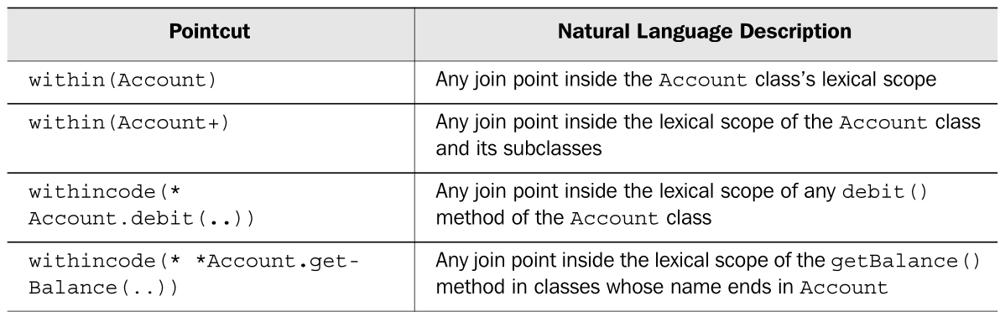

#### Execution object pointcuts

These pointcuts match the join points based on the types of the objects at execution time. The pointcuts capture join points that match either the type `this`, which is the current object, or the `target` object, which is the object on which the method is being called.

Accordingly, there are two execution object pointcut designators: `this()` and `target()`.

In addition to matching the join points, these pointcuts are used to collect the context at the specified join point.

The `this()` pointcut takes the form `this(Type or ObjectIdentifier)`; it matches all join points that have a this object associated with them that is of the specified type or the specified ObjectIdentifier's type. In other words, if you specify `Type`, it will match the join points where the expression `this instanceof <Type>` is true.

The form of this pointcut that specifies ObjectIdentifier is used to collect the this object. If you need to match without collecting context, you will use the form that uses `Type`, but if you need to collect the context, you will use the form that uses `ObjectIdentifier`.

The `target()` pointcut is similar to the `this()` pointcut, but uses the target of the join point instead of `this`.

The `target()` pointcut is normally used with a method call join point, and the target object is the one on which the method is invoked. A `target()` pointcut takes the form `target(Type or ObjectIdentifier)`.

Note that unlike most other pointcuts you cannot use the `*` or `..` wildcard while specifying a type. You don't need to use the `+` wildcard since subtypes that match are already captured by Java inheritance.

Because static methods do not have the `this` object associated with them, the `this()` pointcut will not match the execution of such a method. Similarly, because static methods are not invoked on a object, the `target()` pointcut will not match calls to such a method.

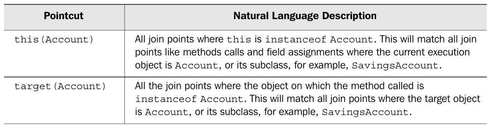

#### Argument pointcuts

These pointcuts capture join points based on the argument type of a join point.

For method and constructor join points, the arguments are simply the method and constructor arguments. For exception handler join points, the handled exception object is considered an argument, whereas for field write access join points, the new value to be set is considered the argument for the join point.

Argument-based pointcuts take the form of `args(TypePattern or ObjectIdentifier, ..)`.

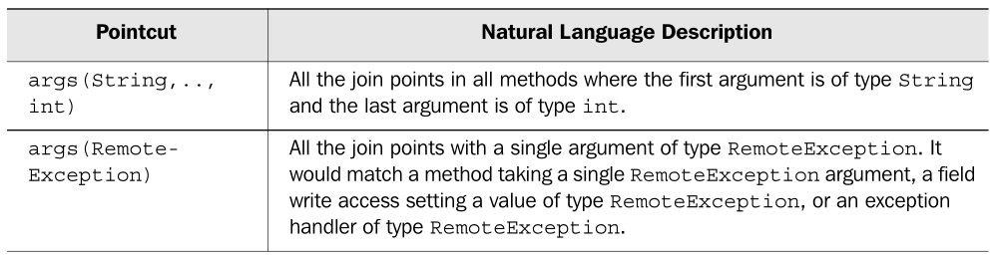

#### Conditional check pointcuts

This pointcut captures join points based on some conditional check at the join point. It takes the form of `if(BooleanExpression)`.

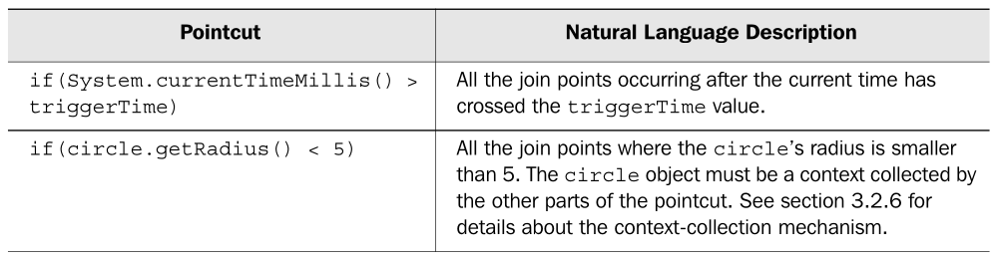
