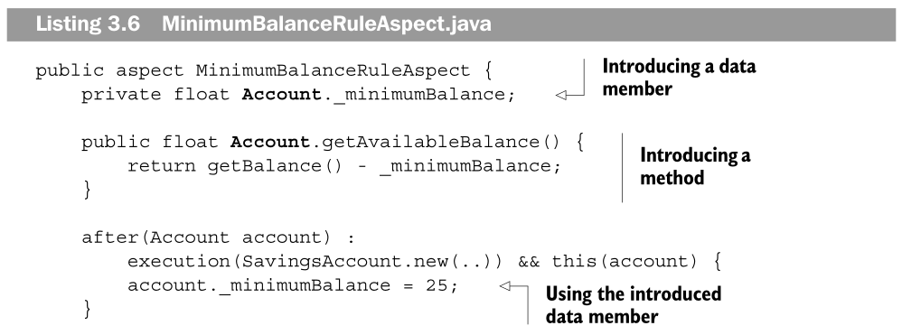
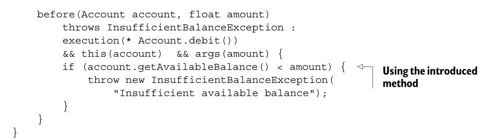

# 3 - AspectJ: syntax basics 3

## Static crosscutting

In AOP, we often find that in addition to affecting dynamic behavior using advice, it is necessary for aspects to affect the static structure in a crosscutting manner.

While dynamic crosscutting modifies the execution behavior of the program, **static crosscutting** modifies the static structure of the types—the classes, interfaces, and other aspects—and their compile-time behavior.

There are four broad classifications of static crosscutting:

-   Member introduction
-   Type-hierarchy modification
-   Compile-time error and warning declaration
-   Exception softening

### Member introduction

Aspects often need to introduce data members and methods into the aspected classes.

For example, in a banking system, implementing a minimum balance rule may require additional data members corresponding to a minimum balance and a method for computing the available balance.

AspectJ provides a mechanism called **introduction** to introduce such members into the specified classes and interfaces in a crosscutting manner.





### Modifying the class hierarchy

A crosscutting implementation often needs to affect a set of classes or interfaces that share a common base type so that certain advice and aspects will work only through the API offered by the base type.

The advice and aspects will then be dependent only on the base type instead of application-specific classes and interfaces.

The result of such an arrangement is the decoupling of the aspect from the application-specific class, thus making the aspect more reusable. With AspectJ, you can modify the inheritance hierarchy of existing classes to declare a superclass and interfaces of an existing class or interface as long as it does not violate Java inheritance rules.

The forms for such a declaration are:

`declare parents : [ChildTypePattern] implements [InterfaceList];`

and

`declare parents : [ChildTypePattern] extends [Class or InterfaceList];`

For example, the following aspect declares that all classes and interfaces in the `entities` package that have the `banking` package as the root are to implement the `Identifiable` interface:

```
aspect AccountTrackingAspect {
    declare parents : banking..entities.* implements Identifiable;
        ... tracking advices
    }
```

### Introducing compile-time errors and warning

AspectJ provides a static crosscutting mechanism to declare compile-time errors and warnings based on certain usage patterns.

The declare error construct provides a way to declare a compile-time error when the compiler detects the presence of a join point matching a given pointcut.

The compiler then issues an error, prints the given message for each detected usage, and aborts the compilation process:

`declare error : <pointcut> : <message>;`

Similarly, the declare warning construct provides a way to declare a compiletime warning, but does not abort the compilation process:

`declare warning : <pointcut> : <message>;`

Note that since these declarations affects compile-time behavior, you must use only statically determinable pointcuts in the declarations. In other words, the pointcuts that use dynamic context to select the matching join points—`this()`, `target()`,
`args()`, `if()`, `cflow(), and `cflowbelow()`—cannot be used for such a declaration.

A typical use of these constructs is to enforce rules, such as prohibiting calls to certain unsupported methods, or issuing a warning about such calls.

The following code example causes the AspectJ compiler to produce a compile-time error if the join point matching the `callToUnsafeCode()` pointcut is found anywhere in the code that is being compiled:

```
declare error : callToUnsafeCode()
: "This third-party code is known to result in crash";
```

The following code is similar, except it produces a compile-time warning instead of an error:

```
declare warning : callToBlockingOperations()
: "Please ensure you are not calling this from AWT thread";
```
