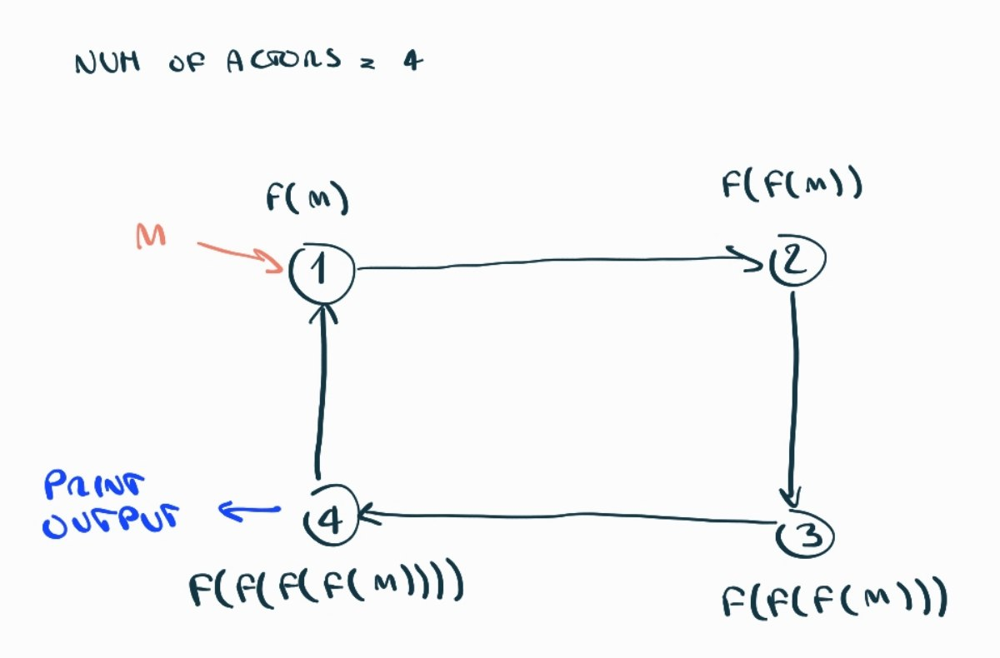
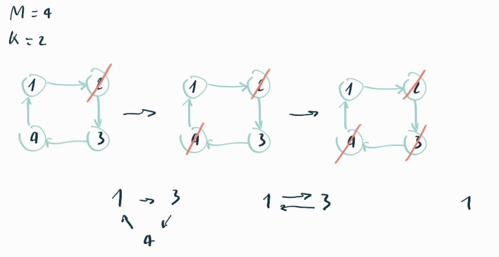
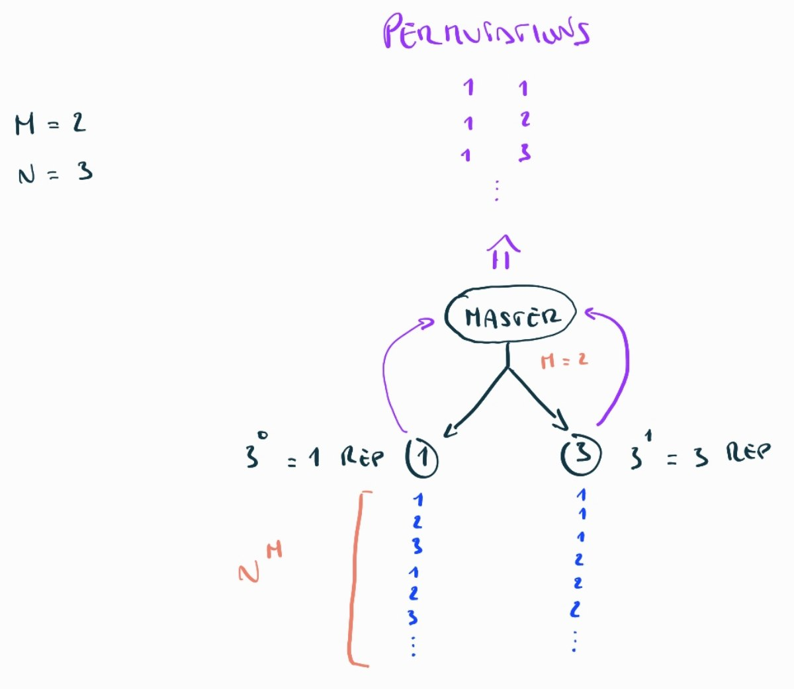
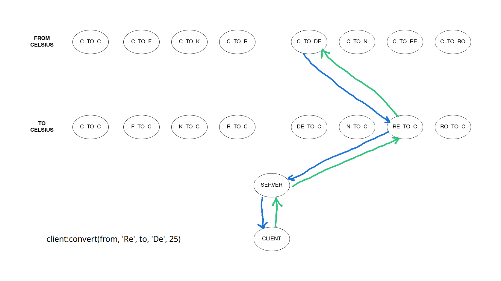

## Distributed Tasks



**File:** `ring.erl`

**TLDR:** anello in cui ogni nodo applica la propria funzione e passa il risultato parziale al nodo successivo

1. Crea un anello di attori dove ciascuno di essi conosce il PID del suo (prossimo) vicino.
2. Il client invia l'input iniziale e il numero di cicli al primo attore che applicherà la sua funzione ed effettuerà il relay del messaggio al suo vicino
3. Che a sua volta applicherà la sua funzione ed trasmetterà il messaggio al suo vicino e così via...

Ogni volta che passiamo attraverso il primo attore diminuiamo il numero di cicli rimanenti e quando raggiungiamo l'ultimo ciclo l'ultimo attore stamperà il risultato calcolato.

#### Note

- se l'ID dell'attore corrente == 1 diminuisci le iterazioni
- se l'ID dell'attore corrente == NumOfActors e siamo all'ultima iterazione stampa il risultato

## Joseph Problem



**File:** `joseph.erl` `hebrew.erl`

**TLDR:** anello con un messaggio che circola attraverso in cui ogni `K-esimo` nodo si suicida, l'ultimo nodo in vita avvisa il master

1. Crea un anello con `N` attori dove ognuno di essi conosce il PID del suo (prossimo) vicino
2. Viene mandato un messaggio al primo attore che circolerà attraverso l'anello
3. Ogni `K-esimo` attore prima di suicidarsi* collegherà l'attore precedente con il successivo
4. Infine l'ultimo attore in vita riferirà al master il suo ID (posizione all'interno dell'anello)

*Suicidarsi in questo caso significa solamente NON effettuare la chiamata ricorsiva al loop del nodo e quindi terminare

#### Note

Ogni attore è in grado di aggiornare il proprio vicino supportando questo messaggio:

```erlang
{newNext, NewNext} ->
    loop(Master, Id, K, NewNext);
```

## Distributed Combinatorics



**File:** `combinator.erl` `generator.erl`

**TLDR:** spawna `M` attori e ognuno dei quali genererà una colonna della lista di permutazioni

```
                   M  N
> combinator:start(2, 3).

A  B
1, 1
1, 2
1, 3
2, 1
2, 2
2, 3
3, 1
3, 2
3, 3
```

`M = ripetizioni / colonne`

`N = valori possibili`

Dobbiamo vedere l'output dal punto di vista delle `M (2)` colonne, ciascuna di esse può essere rappresentata come una lista:

```
B: [1, 2, 3, 1, 2, 3, 1, 2, 3] -> N (3) ^ 0 -> 1
A: [1, 1, 1, 2, 2, 2, 3, 3, 3] -> N (3) ^ 1 -> 3
```

Si nota che le 2 colonne sono composte dalla ripetizione dei `3 (N)` possibili elementi `(1, 2, 3)` seguendo un pattern, la prima colonna ripete ciascun elemento esattamente `1 (3 ^ 0)` volta e la seconda `3 (3 ^ 1)` volte e ci fossere più colonne si continuerebbe `3 ^ 2, 3 ^ 3...`

Notiamo inoltre che le liste sono lunghe esattamente `N ^ M = 3 ^ 2 = 9` elementi!

Dovrò quindi spawnare `M` slaves e ciascuno di essere genererà `N ^ M` elementi seguendo il pattern descritto in precedenza.

#### Note:

```erlang
ColumnLen = trunc(math:pow(N, M))
Elems = lists:seq(1, N)

% Generate the list of repetitions e.g. M = 3, N = 2 -> Reps = [2^0, 2^1, 2^2]
Reps = [trunc(math:pow(N, Exp)) || Exp <- lists:seq(0, M - 1)]

Chunk = lists:duplicate(Rep, Elem)
```

## Hypercube

L'ipercubo può essere visto con un grafo con 16 vertici ognuno con 4 archi.

Un percorso Hamiltoniano è un percorso su un grafo che visita ogni vertice esattamente una volta.

La distanza di Hamming tra due stringhe di uguale lunghezza è il numero di posizioni in cui i simboli corrispondenti sono diversi.

Voglio creare un messaggio annidato del percorso al contrario.

1. Hardcode delle etichette di ciascun vertice
2. Spawno i 16 processi e li associo alle etichette
3. Collego ogni nodo ai suoi 4 vicini, ognuno dei quali ha dist. hamming = 1 (doppio foreach dove faccio comunicare tutti i nodi e filtro con dist. hamming)
4. Verifico se il percorso richiesto dal client è Hamiltoniano mandando un messaggio iniziale con il percorso al nodo "0001" e controllo che l'etichetta successiva sia uno dei 4 vicini di "0001", se è così mando un messaggio al nodo corrispondente all'etichetta, il quale verificherà se l'etichetta successiva è un suo vicino e così via...

#### Note:

```erlang
Labels = [
    "0000", "0001", "0010", "0011",
    "0100", "0101", "0110", "0111",
    "1000", "1001", "1010", "1011",
    "1100", "1101", "1110", "1111"
]

% Example: gray(2) -> ["00","01","11","10"]
gray(0) -> [""];
gray(N) ->
    Gray = gray(N - 1),
    ["0" ++ Ch || Ch <- Gray] ++ ["1" ++ Ch || Ch <- lists:reverse(Gray)].
```

`hamilton(Msg, ["0000" | Path])`

## Distributed Sieves

## You Are Hot



`tempsys:startsys()` deve inizializzare due liste `ToCelsiusFunctions` e `FromCelsiusFunctions` strutturate nel seguente modo:

```erlang
ToCelsiusFunctions = [
    {celsius,    fun(T) -> T end},
    ...
    {romer,      fun(T) -> 40/21 * (T - 7.5) end}
]

FromCelsiusFunctions = [
    {celsius,    fun(T) -> T end},
    ...
    {romer,      fun(T) -> T * 21/40 + 7.5 end}
]
```

poi dovrà spawnare 8 processi `{FromScale, Func}` che gestiscono la conversione **verso** il celsius e 8 processi `{ToScale, Func}` che si occupano la conversione da celsius a un'**altra** scala.

Infine `tempsys:startsys()` spawna un ultimo processo, il `server` che funge da middleman tra i nodi che convertono **verso** il celsius e il client.

**Esempio:**

`client:convert(from, 'Re', to, 'De', 25)`

Il `client` invia un messaggio al `server`, il server effettua il relay del messaggio al nodo `re_to_c` che converte `Re` a `C`. A questo punto il nodo `re_to_c` invia un messaggio a `c_to_de` per completare la conversione. Il nodo `c_to_de` converte `C` a `De` e manda il risultato al nodo `re_to_c` che lo inoltrerà al `server` che infine lo inoltrerà al `client`.

Funziona un po' come un **DNS ricorsivo**.

**Note:**

```erlang
preprocess(Scale) ->
    case Scale of
        'C'  -> celsius;
        'F'  -> fahrenheit;
        'K'  -> kelvin;
        'R'  -> rankine;
        'De' -> delisle;
        'N'  -> newton;
        'Re' -> reaumur;
        'Ro' -> romer
    end.

find_node([], _) -> error;
find_node(Scale1, [{Scale2, Node} | _]) when Scale1 =:= Scale2 -> Node;
find_node(Scale1, [_ | Tail]) -> find_node(Scale1, Tail).
```
