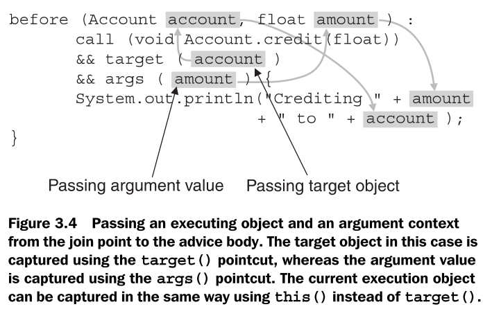
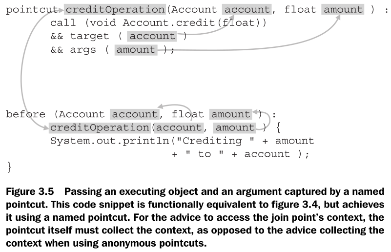
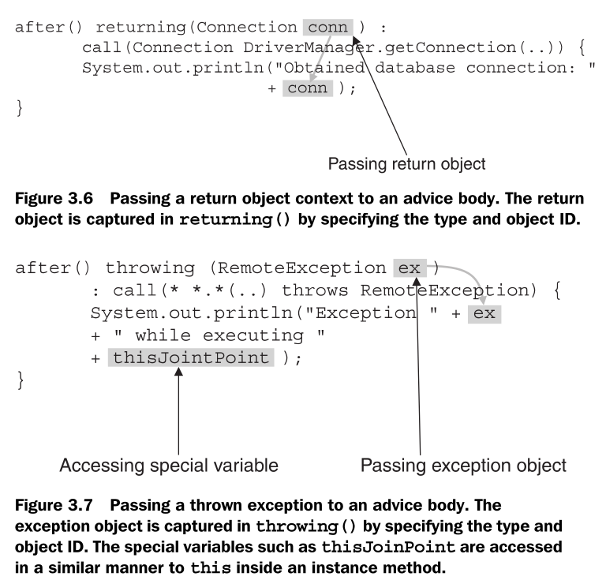

# 3 - AspectJ: syntax basics 2

## Advice

Advice is the action and decision part of the crosscutting puzzle. It helps you define "what to do." Advice is a method-like construct that provides a way to express crosscutting action at the join points that are captured by a pointcut.

An advice can be broken into three parts: the advice declaration, the pointcut specification, and the advice body.

Join points exposed by AspectJ are the only points where you apply an advice.

There are three kinds of advice:

-   _Before advice_ executes prior to the join point

-   _After advice_ executes following the join point

-   _Around advice_ surrounds the join point's execution. This advice is special in that it has the ability to bypass execution, continue the original execution, or cause execution with an altered context

### The before advice

The before advice executes before the execution of the captured join point. In the following code snippet, the advice performs authentication prior to the execution of any method in the `Account` class:

```
before() : call(* Account.*(..)) {
    ... authenticate the user
}
```

If you throw an exception in the before advice, the captured operation won’t execute.

The before advice is typically used for performing pre-operation tasks, such as policy enforcement, logging, and authentication.

### The after advice

The after advice executes after the execution of a join point. Since it is often important to distinguish between normal returns from a join point and those that throw an exception.

After returning **normally**:

```
after() returning : call(* Account.*(..)) {
    ... log the return from operation
}
```

After returning by throwing an **exception**:

```
after() throwing : call(* Account.*(..)) {
    ... log the return from operation
}
```

After returning **either way**:

```
after() : call(* Account.*(..)) {
    ... log the return from operation
}
```

Note that an after advice may be used not just with methods but with any other kind of join point. For example, you could advise a constructor invocation, field write-access, exception handler, and so forth.

### The around advice

The around advice surrounds the join point. It has the ability to bypass the execution of the captured join point completely, or to execute the join point with the same or different arguments.

It may also execute the captured join points multiple times, each with different arguments. Some typical uses of this advice are to perform additional execution before and after the advised join point, to bypass the original operation and perform some other logic in place of it, or to surround the operation with a try/catch block to perform an exception-handling policy.

If within the around advice you want to execute the operation that is at the join point, you must use a special keyword `proceed()` in the body of the advice. Unless you call `proceed()`, the captured join point will be bypassed.

When using `proceed()`, you can pass the context collected by the advice, if any, as the arguments to the captured operation or you can pass completely different arguments. The important thing to remember is that you must pass the same number and types of arguments as collected by the advice.

Since `proceed()` causes the execution of the captured operation, it returns the same value returned by the captured operation. For example, while in an advice to a method that returns a float value, invoking `proceed()` will return the same float value as the captured method.

```
void around(Account account, float amount)
    throws InsufficientBalanceException :
    call(* Account.debit(float) throws InsufficientBalanceException)
    && target(account)
    && args(amount) {
    try {
        proceed(account, amount);
    } catch (InsufficientBalanceException ex) {
        ... overdraft protection logic
    }
}
```

### Passing context from a join point to advice

Advice implementations often require access to data at the join point. For example, to log certain operations, advice needs information about the method and arguments of the operation. This information is called **context**.

Pointcuts, therefore, need to expose the context at the point of execution so it can be passed to the advice implementation. AspectJ provides the `this()`, `target()`, and `args()` pointcuts to collect the context.

You’ll recall that there are two ways to specify each of these pointcuts: by using the type of the objects or by using `ObjectIdentifier`, which simply is the name of the object. When context needs to be passed to the advice, you use the form of the pointcuts that use `ObjectIdentifier`.







### Returning a value from around advice

Each around advice must declare a return value (which could be void). It is typical to declare the return type to match the return type of the join points that are being advised.

For example, if a set of methods that are each returning an integer were advised, you would declare the advice to return an integer. For a field-read join point, you would match the advice’s return type to the accessed field’s type.

Invoking `proceed()` returns the value returned by the join point. Unless you need to manipulate the returned value, around advice will simply return the value that was returned by the `proceed()` statement within it. If you do not invoke `proceed()`, you will still have to return a value appropriate for the advice’s logic.

There are cases when an around advice applies to join points with different return types. For example, if you advise all the methods needing transaction support, the return values of all those methods are likely to be different.

To resolve such situations, the around advice may declare its return value as `Object`. In those cases, if around returns a primitive type after it calls `proceed()`, the primitive type is wrapped in its corresponding wrapper type and performs the opposite, unwrapping after returning from the advice.

For instance, if a join point returns an integer and the advice declares that it will return Object, the integer value will be wrapped in an `Integer` object and it will be returned from the advice. When such a value is assigned, the object is first unwrapped to an integer.

Similarly, if a join point returns a non-primitive type, appropriate typecasts are performed before the return value is assigned. The scheme of returning the `Object` type works even when a captured join point returns a `void` type.

### An example using around advice: failure handling

_RemoteService.java_

```java
import java.rmi.RemoteException;

public class RemoteService {
    public static int getReply() throws RemoteException {
        if(Math.random() > 0.25)
            new RemoteException("Simulated failure occurred");

        System.out.println("Replying");
        return 5;
    }
}
```

_RemoteClient.java_

```java
public class RemoteClient {
    public static void main(String[] args) throws Exception {
        int retVal = RemoteService.getReply();
        System.out.println("Reply is " + retVal);
    }
}
```

_FailureHandling.aj_

```
import java.rmi.RemoteException;

public aspect FailureHandlingAspect {
    final int MAX_RETRIES = 3;

    Object around() throws RemoteException
        : call(* RemoteService.get*(..) throws RemoteException) {
            int retry = 0;

            while(true) {
                try {
                    return proceed();
                } catch(RemoteException ex) {
                    System.out.println("Encountered " + ex);

                    if (++retry > MAX_RETRIES)
                        throw ex;

                    System.out.println("\tRetrying...");
                }
            }
        }
```

### Context collection example: caching

_TestFactorial.java_

```java
import java.util.*;

public class TestFactorial {
    public static void main(String[] args) {
        System.out.println("Result: " + factorial(5) + "\n");
        System.out.println("Result: " + factorial(10) + "\n");
        System.out.println("Result: " + factorial(15) + "\n");
        System.out.println("Result: " + factorial(15) + "\n");
    }

    public static long factorial(int n) {
        if (n == 0)
            return 1;

        return n * factorial(n-1);
    }
}
```

_OptimizeFactorial.aj_

```
import java.util.*;

public aspect OptimizeFactorialAspect {
    pointcut factorialOperation(int n) :
        call(long *.factorial(int)) && args(n);

    pointcut topLevelFactorialOperation(int n) :
        factorialOperation(n)
        && !cflowbelow(factorialOperation(int));

    private Map _factorialCache = new HashMap();

    before(int n) : topLevelFactorialOperation(n) {
        System.out.println("Seeking factorial for " + n);
    }

    long around(int n) : factorialOperation(n) {
        Object cachedValue = _factorialCache.get(new Integer(n));

        if (cachedValue != null) {
            System.out.println("Found cached value for " + n + ": " + cachedValue);
            return ((Long)cachedValue).longValue();
        }

        return proceed(n);
    }

    after(int n) returning(long result)
        : topLevelFactorialOperation(n) {
        _factorialCache.put(new Integer(n), new Long(result));
    }
}
```
