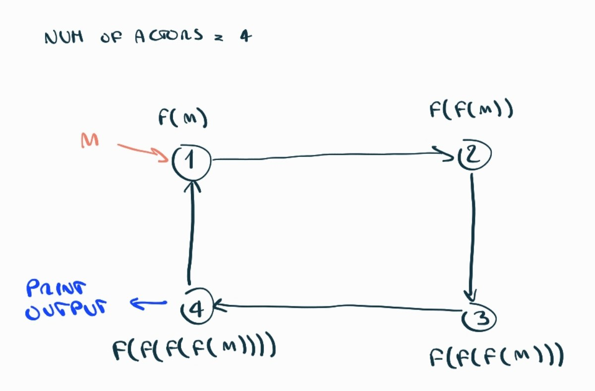
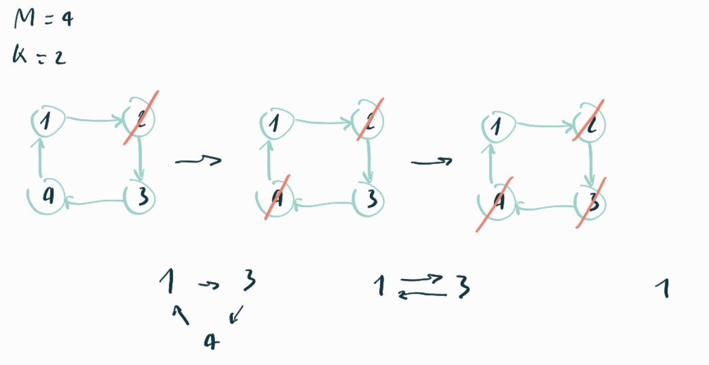
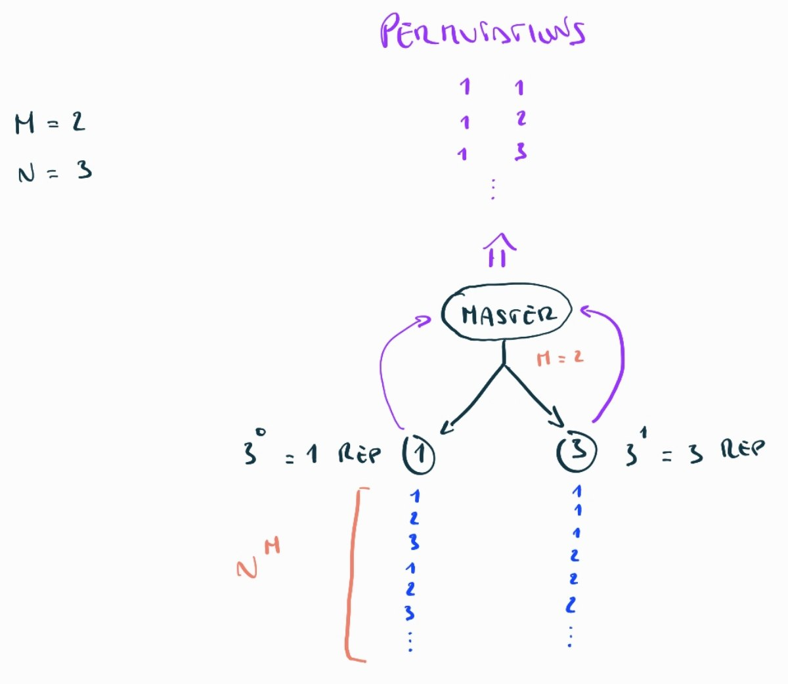

## Distributed Tasks



**Files:** `ring.erl ~60 loc 7 funcs`

**TLDR:** ring where each node applies its function and passes the partial result to the next node

Create a ring of connected actors where each one knows the PID of his next neighbor. Then the client sends the initial input and the number of loops to the first actor that will apply his function and relay the message to his neighbor, who in turn will apply his function and relay it to his neighbor and so on.

Each time we pass through the first actor we decrease the number of loops remaining and when the we finally reach the last loop the last actor will print out the computed result.

#### Notes
- if the ID of current actor == 1 decrease the iterations
- if the ID of current actor == NumOfActors and we are at the last iteration print out the result

## Joseph Problem



**Files:** `joseph.erl ~20 loc 1 func` `hebrew.erl ~30 loc 2 funcs`

**TLDR:** ring with a message circulating through in which every `K-th` node kills itself, the last one alive reports back.

Create a ring of `N` connected actors where each one knows the PID of his next neighbor and send a message that will circulate through the ring. Each `K-th` actor will link the previous actor with the next actor in the ring before killing himself, the last actor alive reports back with his ID (position in the ring).

#### Notes
Each actor is able to update his neighbor by supporting this message:

```erlang
{newNext, NewNext} ->
    loop(Master, Id, K, NewNext);
```

## Distributed Combinatorics



**Files:** `combinator.erl ~50 loc 5 func` `generator.erl ~20 loc 2 funcs`

**TLDR:** spawn `M` actors each of which will generate a column of the list of permutations

```
                   M  N
> combinator:start(2, 3).

A  B
1, 1
1, 2
1, 3
2, 1
2, 2
2, 3
3, 1
3, 2
3, 3
```

`M = ripetizioni / colonne`

`N = valori possibili`

Dobbiamo vedere l'output dal punto di vista delle `M (2)` colonne, ciascuna di esse può essere rappresentata come una lista:

```
B: [1, 2, 3, 1, 2, 3, 1, 2, 3] -> N (3) ^ 0 -> 1
A: [1, 1, 1, 2, 2, 2, 3, 3, 3] -> N (3) ^ 1 -> 3
```

Si nota che le 2 colonne sono composte dalla ripetizione dei `3 (N)` possibili elementi `(1, 2, 3)` seguendo un pattern, la prima colonna ripete ciascun elemento esattamente `1 (3 ^ 0)` volta e la seconda `3 (3 ^ 1)` volte e ci fossere più colonne si continuerebbe `3 ^ 2, 3 ^ 3...`

Notiamo inoltre che le liste sono lunghe esattamente `N ^ M = 3 ^ 2 = 9` elementi!

Dovrò quindi spawnare `M` slaves e ciascuno di essere genererà `N ^ M` elementi seguendo il pattern descritto in precedenza.

#### Notes:

```erlang
ColumnLen = trunc(math:pow(N, M))
Elems = lists:seq(1, N)

% Generate the list of repetitions e.g. M = 3, N = 2 -> Reps = [2^0, 2^1, 2^2]
Reps = [trunc(math:pow(N, Exp)) || Exp <- lists:seq(0, M - 1)]

Chunk = lists:duplicate(Rep, Elem)
```

## Hypercube

L'ipercubo può essere visto con un grafo con 16 vertici ognuno con 4 archi.

Un percorso Hamiltoniano è un percorso su un grafo che visita ogni vertice esattamente una volta.

La distanza di Hamming tra due stringhe di uguale lunghezza è il numero di posizioni in cui i simboli corrispondenti sono diversi.

Voglio creare un messaggio annidato del percorso al contrario.

1. Hardcode delle etichette di ciascun vertice
2. Spawno i 16 processi e li associo alle etichette
3. Collego ogni nodo ai suoi 4 vicini, ognuno dei quali ha dist. hamming = 1 (doppio foreach dove faccio comunicare tutti i nodi e filtro con dist. hamming)
4. Verifico se il percorso richiesto dal client è Hamiltoniano mandando un messaggio iniziale con il percorso al nodo "0001" e controllo che l'etichetta successiva sia uno dei 4 vicini di "0001", se è così mando un messaggio al nodo corrispondente all'etichetta, il quale verificherà se l'etichetta successiva è un suo vicino e così via...

```erlang
% Example: gray(2) -> ["00","01","11","10"]
gray(0) -> [""];
gray(N) ->
    Gray = gray(N - 1),
    ["0" ++ Ch || Ch <- Gray] ++ ["1" ++ Ch || Ch <- lists:reverse(Gray)].
```
`hamilton(Msg, ["0000" | Path])`

## Distributed Sieves


